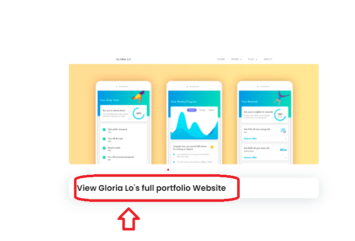
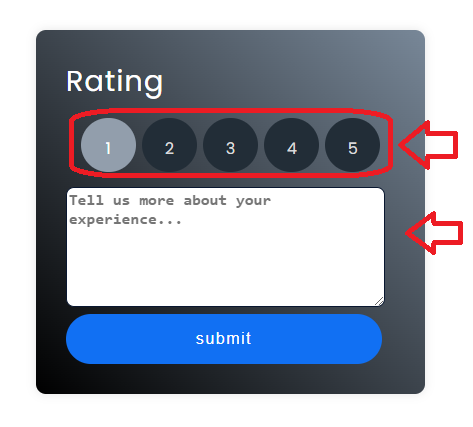

# UX Design portfolio Project with feedback and rating the candidates
# Note : This Code is return fully on HTML and the functionality and reuseable HTML Components are written inside the Java Script Files
### Responsive Mobile,PC,Tablet

# Demo Link: https://main--phenomenal-banoffee-8a8852.netlify.app/

- Responsive Website HTML CSS & JavaScript.
- Contains animations when scrolling.
- Smooth scrolling in each section.
- Developed first with the Mobile First methodology, then for desktop.

# Usage
# Note:This code is written dynamically,so that code can be reused and can be easily connect with an api

# 1.) The Page Usage is to view the portfolio submitted by the job candidates.For Example :I have taken a concept UX design Portfolio of 5 people(if more needed it can be added)
# 2.) This site Allow the HR to view their portfolio and give ratings and feedback regarding to their portfolio.
# 3.) Once the rating is given,the review page will shows the ratings given to the job candidates.

# Guide(Help Notes)

# This is the landging page  
  

# This is were you can view job candidates portfolio

you can view their file and asses their portfolio

# This is were you can give Ratings and Feedback Regarding the portfolio

# View their Results based on ratings and feedback that you give

